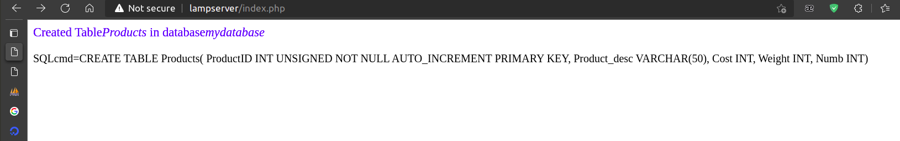
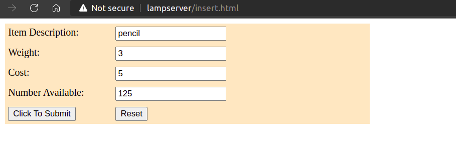
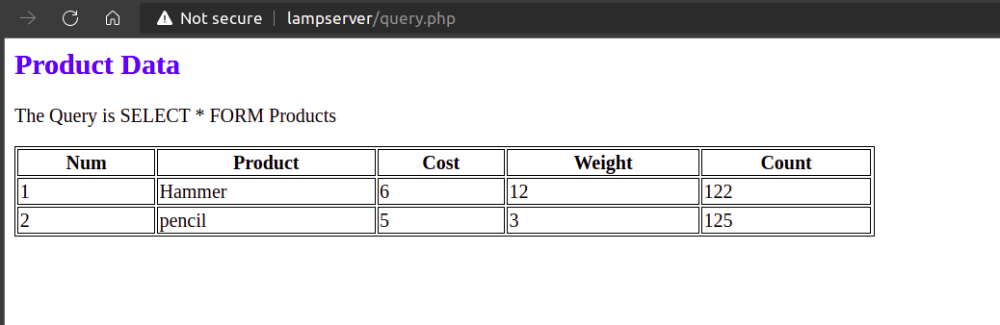
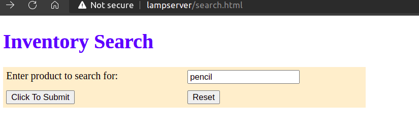
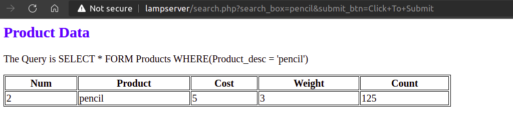
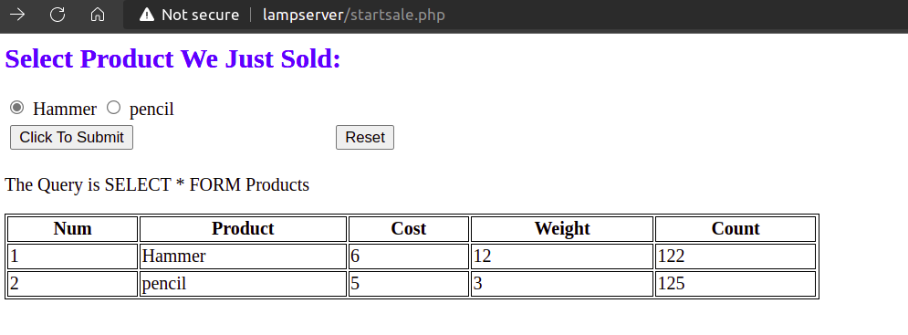
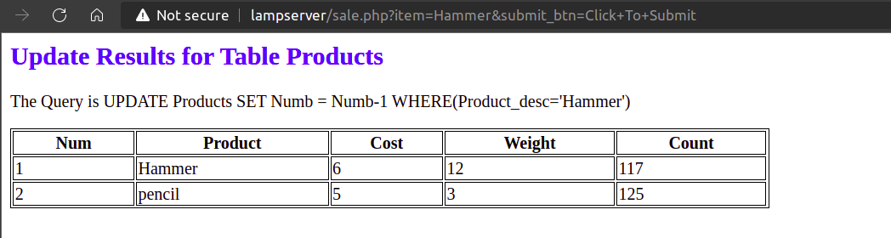
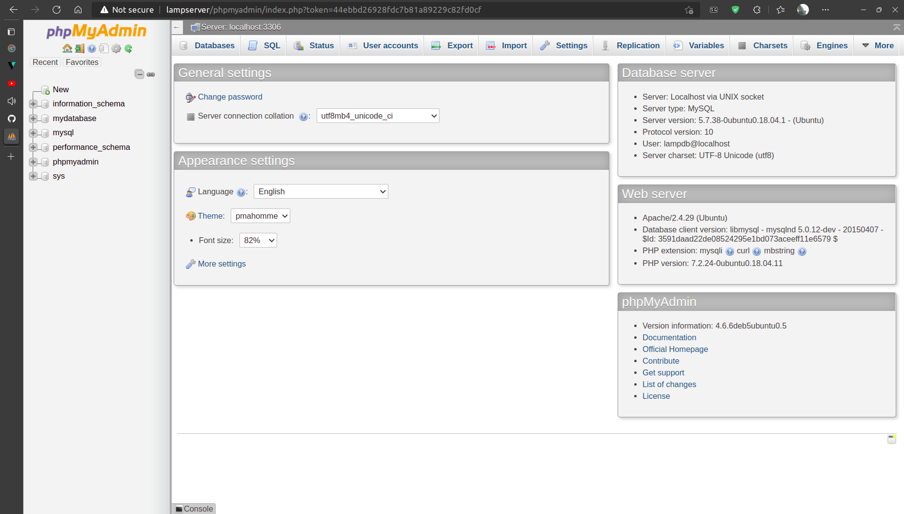
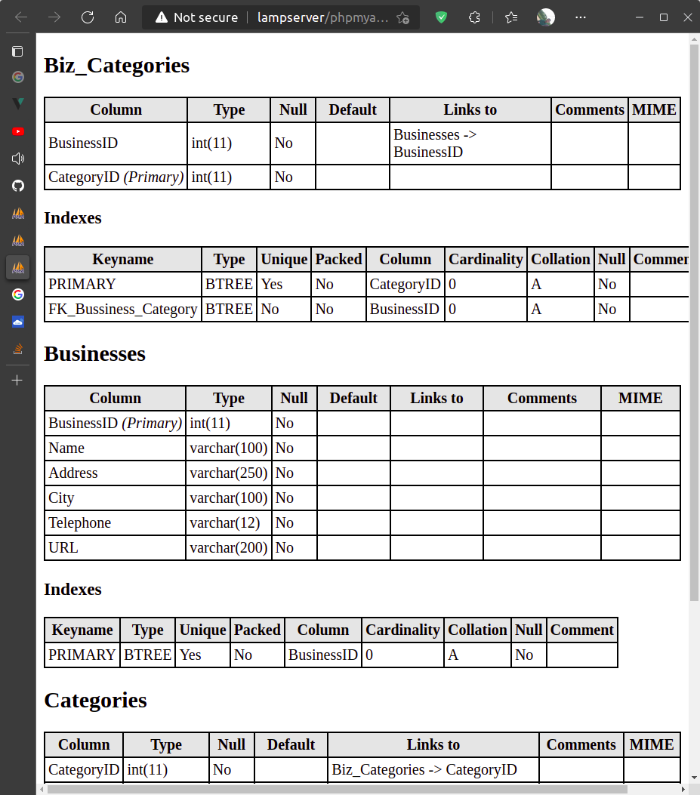
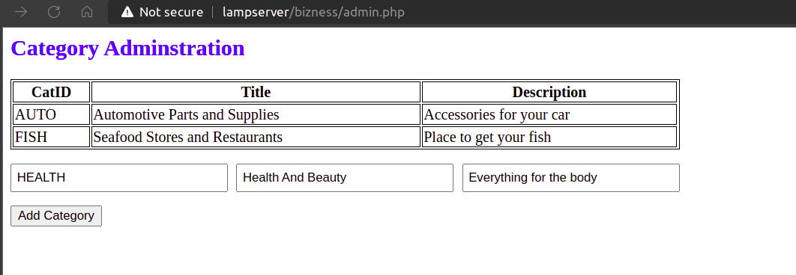

<h1 style="text-align: center;">BÀI TẬP LAB 4 NHÓM 8</h1>

<h2 style="text-align: center;">MySQL & PHP</h2>
<hr>

| STT | Thành Viên       | MSSV     |
| ---:| ----------------:|---------:|
| 1   | Ngô Văn Quang    | 20183813 |
| 2   | Bùi Quang Huy    | 20183764 |
| 3   | Trần Đình Nguyên | 20183807 |
| 4   | Bùi Đức Mạnh     | 20183793 |

<hr>

## 4.1 Run the example in the lecture slides
### 4.1.1 Create table Products using PHP scripts
**Tạo bảng bằng cách sử dụng PHP:**
<br>

```php
<html>
    <head>
        <title>Create Table</title>
    </head>
    
    <body>
        <?php
            $server = 'localhost';
            $user   = 'lampdb';
            $pass   = '********';
            $mydb   = 'mydatabase';
            $table_name = 'Products';
            
            $link = mysqli_connect($server, $user, $pass, $mydb);
 
            // Check connection
            if($link === false){
                die("ERROR: Could not connect. " . mysqli_connect_error());
            }
 
            // Attempt create table query execution
            $sql = "CREATE TABLE $table_name(
                        ProductID INT UNSIGNED NOT NULL AUTO_INCREMENT PRIMARY KEY,
                        Product_desc VARCHAR(50),
                        Cost INT,
                        Weight INT,
                        Numb INT)";

            if(mysqli_query($link, $sql)){
                print '<font size="4" color="blue" >Created Table';
                print "<i>$table_name</i> in database<i>$mydb</i><br></font>";
                print "<br>SQLcmd=$sql";
            } else{
                die ("Table Create Creation Failed SQLcmd=$sql");
            }
 
            // Close connection
            mysqli_close($link);
        ?>
    </body>
</html>
```
<br>
<hr>

**Kết quả sau khi tạo bảng thành công:**
<br>



*Finger 1: Create table using php scripts*

<br>

### 4.1.2 Insert data to Products

**Thêm dữ liệu vào bảng:**
<br>

```php
<html>
    <head>
        <title>Insert Results</title>
    </head>
    
    <body>
        <?php
            $server = 'localhost';
            $user   = 'lampdb';
            $pass   = '********';
            $mydb   = 'mydatabase';
            $table_name = 'Products';

            // variables were geted form resquest
            // reference from stackoverflow: https://stackoverflow.com/questions/18023440/php-mysql-insert-into-with-get-method
            if(isset($_GET['item_description']))
            {
                $item_description = $_GET['item_description'];
            } else {
                $item_description = "";
            }
            
            if(isset($_GET['cost']))
            {
                $cost = $_GET['cost'];
            } else {
                $cost = "";
            }

            if(isset($_GET['weight']))
            {
                $weight = $_GET['weight'];
            } else {
                $weight = "";
            }

            if(isset($_GET['number_available']))
            {
                $number_available = $_GET['number_available'];
            } else {
                $number_available = "";
            }

            $link = mysqli_connect($server, $user, $pass, $mydb);
 
            // Check connection
            if($link === false){
                die("ERROR: Could not connect. " . mysqli_connect_error());
            }
 
            // Attempt create table query execution
            $sql = "INSERT INTO $table_name VALUES('0', '$item_description' , '$cost', '$weight', '$number_available')";

            if(mysqli_query($link, $sql)){
                print "The Query is INSERT INTO $table_name VALUES($item_description, $cost, $weight, $number_available)";
                print "Insert into perl_pgm_com was successfull";
            } else{
                die ("Table Create Creation Failed SQLcmd=$sql");
            }
 
            // Close connection
            mysqli_close($link);
        ?>
    </body>
</html>
```

**Tạo HTML Form để nhập dữ liệu:**

```html
<!DOCTYPE html>
<html>
    <head>
        <title>Insert Inventory</title>
    </head>

    <style>
        .container {
            max-width:40%;
        }
        .wrap {
            width: 100%;
        }
        .form_line {
            padding: 5px;
            width: 100%;
            background-color: bisque;
            display: flex;
        }
        .form_line__label {
            width: 30%;
        }
        .form_line__box {
            width: 50%;
        }
    </style>

    <body>
        <div class="container">
            <form action="/insert_table.php" method="get" target="_blank">
                <div class="wrap">
                    <div class="form_line">
                        <div class="form_line__label">
                            <label for="item_description">Item Description:</label>
                        </div>
                        <div class="from_line__box">
                            <input type="text" id="item_description" name="item_description">
                        </div>
                    </div>
                    
                    <div class="form_line">
                        <div class="form_line__label">
                            <label for="weight">Weight:</label>
                        </div>
                        <div class="from_line__box">
                            <input type="text" id="weight" name="weight">
                        </div>
                    </div>

                    <div class="form_line">
                        <div class="form_line__label">
                            <label for="cost">Cost:</label>
                        </div>
                        <div class="from_line__box">
                            <input type="text" id="cost" name="cost">
                        </div>
                    </div>

                    <div class="form_line">
                        <div class="form_line__label">
                            <label for="number_available">Number Available:</label>
                        </div>
                        <div class="from_line__box">
                            <input type="text" id="number_available" name="number_available">
                        </div>
                    </div>

                    <div class="form_line">
                        <div class="form_line__label">
                            <input type="submit" id="submit_btn" value="Click To Submit">
                        </div>

                        <div class="from_line__box">
                            <input type="button" id="reset_btn" value="Reset">
                        </div>
                    </div>
                    
                </div>
            

          </form>
        </div>
        
    </body>
</html>
```
<br>
<hr>

**Kết quả khi thêm dữ liệu vào bảng thành công:**

<br>



*Finger 2: Insert HTML form*

<br>

<br>


*Finger 3: Insert data to table using php scripts*

<br>

### 4.1.3 Display list of products

**Hiển thị danh sách sản phẩm:**

<br>

```php
<html>
    <head>
        <title>Table Output</title>
        <style>
            table, th, td {
                border:1px solid black;
            }
        </style>
    </head>
    
    <body>
        <?php
            $server = 'localhost';
            $user   = 'lampdb';
            $pass   = '********';
            $mydb   = 'mydatabase';
            $table_name = 'Products';

            // variables were geted form resquest
            // reference from stackoverflow: https://stackoverflow.com/questions/18023440/php-mysql-insert-into-with-get-method
            

            $link = mysqli_connect($server, $user, $pass, $mydb);
 
            // Check connection
            if($link === false){
                die("ERROR: Could not connect. " . mysqli_connect_error());
            }
 
            // Attempt create table query execution
            $sql = "SELECT * from Products";
            
            $getAllProducts = mysqli_query($link, $sql);
            if($getAllProducts){
                console.log("The Query is SELECT * FORM $table_name is successfull");
                
                
            } else{
                die ("Query Failed SQLcmd=$sql");
            }
 
            // Close connection
            mysqli_close($link);
        ?>
        <h2 style="color: blue;">Product Data</h2> 
        <p>The Query is SELECT * FORM <?php echo $table_name ?></p>
            <table style="width:50%">
                <tr>
                    <th>Num</th>
                    <th>Product</th>
                    <th>Cost</th>
                    <th>Weight</th>
                    <th>Count</th>
                </tr>
        <?php foreach($getAllProducts as $product): ?>
                <tr>
                    <td><span><?php echo $product['ProductID'] ?></span></td>
                    <td><span><?php echo $product['Product_desc'] ?></span></td>
                    <td><span><?php echo $product['Cost'] ?></span></td>
                    <td><span><?php echo $product['Weight'] ?></span></td>
                    <td><span><?php echo $product['Numb'] ?></span></td>
                </tr>
        <?php endforeach; ?>
            </table>
    </body>
</html>
```
<br>
<hr>

**Kết quả:**

<br>



*Finger 4: Display a list of Products*

<br>

### 4.1.4 Search products

**HTML From để tìm kiếm sản phẩm:**
```html
<!DOCTYPE html>
<html>
    <head>
        <title>Inventory Search</title>
        
        <style>
            .form_wrap {
                width: 40%;
                background-color: blanchedalmond;
            }
            .form_line {
                padding: 5px;
                width: 100%;
                display: flex;
                justify-content: space-around;
            }
            .form_line__left {
                width: 50%;
            }
            .form_line__right {
                width: 50%;
            }
        </style>
    </head>
    <body>
        <h1 style="color: blue;">Inventory Search</h1>
        <form action="/search.php" method="get">
            <div class="form_wrap">
                <div class="form_line">
                    <div class="form_line__left">
                        <span>Enter product to search for:</span>
                    </div>
                    
                    <div class="form_line__right">
                        <input type="text" name="search_box" id="search_box">                 
                    </div>
                </div>

                <div class="form_line">
                    <div class="form_line__left">
                        <input type="submit" name="submit_btn" id="submit_btn" value="Click To Submit">
                    </div>

                    <div class="form_line__right">
                        <input type="button" src="/search.html" name="reset_btn" id="reset_btn" value="Reset">
                    </div>
                </div>
            </div>
            
        </form>
        
    </body>
</html>
```
<br>

**Tìm kiếm sản phẩm sử dụng PHP:**
```php
<html>
    <head>
        <title>Search Result</title>
        <style>
            table, th, td {
                border:1px solid black;
            }
        </style>
    </head>
    
    <body>
        <?php
            $server = 'localhost';
            $user   = 'lampdb';
            $pass   = '********';
            $mydb   = 'mydatabase';
            $table_name = 'Products';

            // variables were geted form resquest
            // reference from stackoverflow: https://stackoverflow.com/questions/18023440/php-mysql-insert-into-with-get-method
            

            $link = mysqli_connect($server, $user, $pass, $mydb);
 
            // Check connection
            if($link === false){
                die("ERROR: Could not connect. " . mysqli_connect_error());
            }
 
            // Attempt create table query execution
            if(isset($_GET['search_box']))
            {
                $search_box = $_GET['search_box'];
            } else {
                $search_box = "";
            }
            
            $sql = "SELECT * from Products WHERE(Product_desc = '$search_box')";
            
            $getAllProducts = mysqli_query($link, $sql);
            if($getAllProducts){
                console.log("The Query is SELECT * FORM $table_name is successfull");
                
                
            } else{
                die ("Query Failed SQLcmd=$sql");
            }
 
            // Close connection
            mysqli_close($link);
        ?>
        <h2 style="color: blue;">Product Data</h2> 
        <p>The Query is SELECT * FORM <?php echo $table_name ?> WHERE(Product_desc = '<?php echo $search_box ?>')</p>
            <table style="width:50%">
                <tr>
                    <th>Num</th>
                    <th>Product</th>
                    <th>Cost</th>
                    <th>Weight</th>
                    <th>Count</th>
                </tr>
        <?php foreach($getAllProducts as $product): ?>
                <tr>
                    <td><span><?php echo $product['ProductID'] ?></span></td>
                    <td><span><?php echo $product['Product_desc'] ?></span></td>
                    <td><span><?php echo $product['Cost'] ?></span></td>
                    <td><span><?php echo $product['Weight'] ?></span></td>
                    <td><span><?php echo $product['Numb'] ?></span></td>
                </tr>
        <?php endforeach; ?>
            </table>
    </body>
</html>
```
<br>
<hr>

**Kết quả:**



*Finger 5: HTML Form to search a product*

<br>



*Finger 6: Display search results*

<br>

### 4.1.5 Update product
**Cập nhật sản phẩm sử dụng PHP:**
```php
<html>
    <head>
        <title>Table Output</title>
        <style>
            table, th, td {
                border:1px solid black;
            }
         
            .form_line {
                padding: 5px;
                width: 40%;
                display: flex;
            }
            .form_line__left {
                width: 50%;
            }
            .form_line__right {
                width: 50%;
            }
        </style>
    </head>
    
    <body>
        <?php
            $server = 'localhost';
            $user   = 'lampdb';
            $pass   = '********';
            $mydb   = 'mydatabase';
            $table_name = 'Products';

            // variables were geted form resquest
            // reference from stackoverflow: https://stackoverflow.com/questions/18023440/php-mysql-insert-into-with-get-method
            

            $link = mysqli_connect($server, $user, $pass, $mydb);
 
            // Check connection
            if($link === false){
                die("ERROR: Could not connect. " . mysqli_connect_error());
            }
 
            // Attempt create table query execution
            $sql = "SELECT * from Products";
            
            $getAllProducts = mysqli_query($link, $sql);
            if($getAllProducts){
                console.log("The Query is SELECT * FORM $table_name is successfull");
                
                
            } else{
                die ("Query Failed SQLcmd=$sql");
            }
 
            // Close connection
            mysqli_close($link);
        ?>
        <h2 style="color: blue;">Select Product We Just Sold:</h2> 
        <form action="/sale.php" method="get">
            <div>
                <?php foreach($getAllProducts as $product): ?>
                    <input type="radio" id="<?php echo $product['ProductID'] ?>" name="item" value="<?php echo $product['Product_desc'] ?>">
                    <label for="<?php echo $product['Product_desc'] ?>"><?php echo $product['Product_desc'] ?></label>
                <?php endforeach; ?>
            </div>
            <div class="form_line">
                <div class="form_line__left">
                    <input type="submit" name="submit_btn" id="submit_btn" value="Click To Submit">
                </div>

                <div class="form_line__right">
                    <input type="button" src="/startsale.php" name="reset_btn" id="reset_btn" value="Reset">
                </div>
            </div>
        </form>

        <p>The Query is SELECT * FORM <?php echo $table_name ?></p>
            <table style="width:50%">
                <tr>
                    <th>Num</th>
                    <th>Product</th>
                    <th>Cost</th>
                    <th>Weight</th>
                    <th>Count</th>
                </tr>
        <?php foreach($getAllProducts as $product): ?>
                <tr>
                    <td><span><?php echo $product['ProductID'] ?></span></td>
                    <td><span><?php echo $product['Product_desc'] ?></span></td>
                    <td><span><?php echo $product['Cost'] ?></span></td>
                    <td><span><?php echo $product['Weight'] ?></span></td>
                    <td><span><?php echo $product['Numb'] ?></span></td>
                </tr>
        <?php endforeach; ?>
            </table>
    </body>
</html>
```
<br>

**PHP From để cập nhật sản phẩm:**
```php
<html>
    <head>
        <title>Table Output</title>
        <style>
            table, th, td {
                border:1px solid black;
            }
        </style>
    </head>
    
    <body>
        <?php
            $server = 'localhost';
            $user   = 'lampdb';
            $pass   = '********';
            $mydb   = 'mydatabase';
            $table_name = 'Products';

            // variables were geted form resquest
            // reference from stackoverflow: https://stackoverflow.com/questions/18023440/php-mysql-insert-into-with-get-method
            if(isset($_GET['item']))
            {
                $update_item = $_GET['item'];
            } else {
                $update_item= "";
            }    

            $link = mysqli_connect($server, $user, $pass, $mydb);
 
            // Check connection
            if($link === false){
                die("ERROR: Could not connect. " . mysqli_connect_error());
            }
 
            // Attempt create table query execution
            $sql_update = "UPDATE $table_name SET Numb = Numb-1 WHERE(Product_desc='$update_item')";
            $sql = "SELECT * from Products";
            $updateProduct = mysqli_query($link, $sql_update);
            if($updateProduct)
            {

            } else{
                die ("Query Failed SQLcmd=$sql_update");
            }

            $getAllProducts = mysqli_query($link, $sql);
            if($getAllProducts){
                console.log("The Query is SELECT * FORM $table_name is successfull");
            } else{
                die ("Query Failed SQLcmd=$sql");
            }
 
            // Close connection
            mysqli_close($link);
        ?>
        <h2 style="color: blue;">Update Results for Table Products</h2> 
        <p>The Query is <?php echo $sql_update ?></p>
            <table style="width:50%">
                <tr>
                    <th>Num</th>
                    <th>Product</th>
                    <th>Cost</th>
                    <th>Weight</th>
                    <th>Count</th>
                </tr>
        <?php foreach($getAllProducts as $product): ?>
                <tr>
                    <td><span><?php echo $product['ProductID'] ?></span></td>
                    <td><span><?php echo $product['Product_desc'] ?></span></td>
                    <td><span><?php echo $product['Cost'] ?></span></td>
                    <td><span><?php echo $product['Weight'] ?></span></td>
                    <td><span><?php echo $product['Numb'] ?></span></td>
                </tr>
        <?php endforeach; ?>
            </table>
    </body>
</html>
```
<br>
<hr>

**Kết quả**



*Finger 7: PHP Form to update a product*

<br>



*Finger 8: Update a product is successfull*

<br>


## 4.2 Open and use phpMyAdmin to create a database and tables
### 4.2.1 Open Zend Server Community Edition
Phần này nhóm cài đặt phpmyadmin từ apt package manager nên không sử dụng Zend Server 
### 4.2.2 Open phpMyAdmin

Màn hình login của phpMyAdmin:


*Finger 9: phpmyadmin login screen*

<br>

Màn hình Home page của phpMyAdmin:


*Finger 10: phpmyadmin homepage*

<br>

### 4.2.3 Create tables and relationships for business listing service


Tạo các bảng và quan hệ giữa các bảng trong bussiness_service database:



*Finger 11: business_service database table structure 1*

<br>


*Finger 12: business_service database table structure 2*

<br>

## 4.3 Category Administration page

<br>



*Finger 13: Category Administration page*

<br>

## 4.4 Business Registration page
## 4.5 Business Listing page
